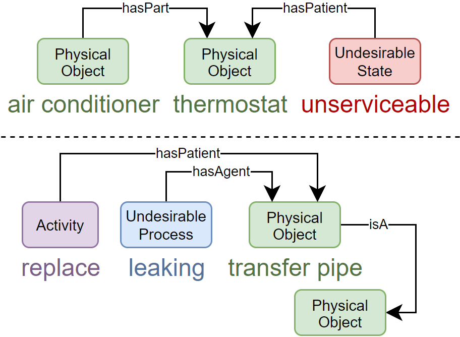
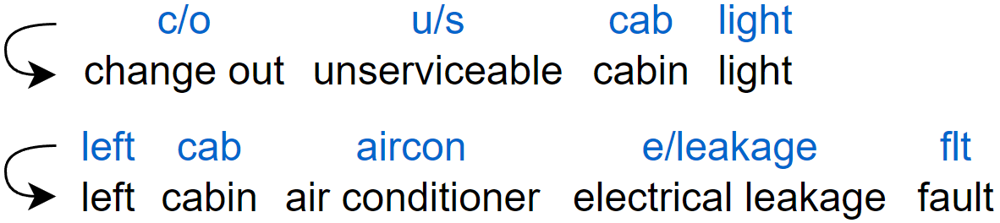

# Datasets

The datasets used in this research can be found in the [`data`](https://github.com/nlp-tlp/Hons24_AllisonLau/tree/main/data) directory. The following datasets are used/analysed in this project:

- [**FMC-MWO2KG dataset**](https://paperswithcode.com/dataset/fmc-mwo2kg): labelled dataset of failure mode classification (FMC) from failure observations
- [**MaintIE dataset**](https://github.com/nlp-tlp/maintie): annotated dataset of maintenance work orders with entities and relations in the MaintIE schema

- [**MaintNorm dataset**](https://github.com/nlp-tlp/maintnorm): maintenance work order dataset with pre- and post-lexically normalised text (combined)

- [**Corrections dictionary**](https://github.com/nlp-tlp/Hons24_AllisonLau/tree/main/data/Corrections): dictionary of corrections used for the humanisation step of synthetic data generation pipeline

## Dataset Analysis

The data analysis code can be found in the [`DataAnalysis`](https://github.com/nlp-tlp/Hons24_AllisonLau/tree/main/DataAnalysis) directory. The following analyses are performed:

- **FMC-MWO2KG dataset analysis**: found in [`mwo2kg_analysis.ipynb`](https://github.com/nlp-tlp/Hons24_AllisonLau/blob/main/DataAnalysis/mwo2kg_analysis.ipynb) - analysis of the FMC-MWO2KG dataset - frequency of failure mode codes (classes), aligning the failure observations with the MWOs in the dataset
- **MaintIE dataset analysis**: found in [`maintie_analysis.ipynb`](https://github.com/nlp-tlp/Hons24_AllisonLau/blob/main/DataAnalysis/maintie_analysis.ipynb) - analysis of the MaintIE dataset - frequency of total entities and relations, frequency of unique entities and relations, types of triples, number of tokens in the MWOs (min, max, average), number of hierarchical relations between equipment and their components, extract undesirable events (failure modes), analysis of manual FMC mapping, frequency distribution of sentence lengths
- **MaintNorm dataset analysis**: found in [`maintnorm_analysis.ipynb`](https://github.com/nlp-tlp/Hons24_AllisonLau/blob/main/DataAnalysis/maintnorm_analysis.ipynb) - extract relevant pairs of pre- and post-lexically normalised MWO tokens for compiling a corrections dictionary
- **Synthetic data analysis**: found in [`synthetic_analysis.ipynb`](https://github.com/nlp-tlp/Hons24_AllisonLau/blob/main/DataAnalysis/synthetic_analysis.ipynb) - number of tokens in the MWOs (min, max, average), sentence length distribution (human vs synthetic data), filter potential LLM hallucinations for analysis (output not strictly following given prompt)
