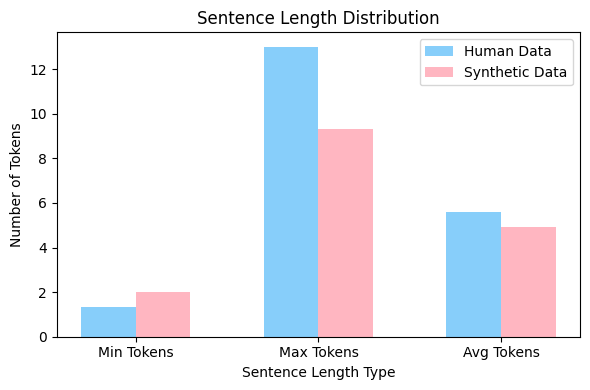

# Evaluation

The quality of the synthetic MWO data generated is evaluated using the following methods:

1. [Paths and Synthetic MWO Analysis](#paths-and-synthetic-mwo-analysis)
2. [Turing Test](#turing-test)
3. [Ranking Test](#ranking-test)

## Paths and Synthetic MWO Analysis

### Number of Valid Paths 

We extracted 2,237 valid equipment-failure paths from the MaintIE KG, with the most common being State-Patient (1,208 paths). After SME validation, the number increased to 3,794, with significant gains in State-Agent-Activity and Process-Agent-Patient paths. The following table shows the number of valid paths before and after SME validation:

| Path Type               | Number of Valid Paths | Direct | Additional | Total before SME Validation | Total after SME Validation |
|-------------------------|-----------------------|--------|------------|-----------------------------|----------------------------|
| Object-Property         | 26                    | 23     | 49         | 49                          | 49                         |
| Process-Agent           | 77                    | 314    | 391        | 391                         | 391                        |
| Process-Patient         | 38                    | 231    | 269        | 269                         | 269                        |
| State-Patient           | 293                   | 915    | 1208       | 1208                        | 1208                       |
| Object-Property-State   | 1                     | 2      | 3          | 3                           | 3                          |
| State-Agent-Activity    | 25                    | 111    | 136        | 607                         | 607                        |
| State-Agent-Patient     | 7                     | 24     | 31         | 37                          | 37                         |
| Process-Agent-Patient   | 31                    | 119    | 150        | 1230                        | 1230                       |
| **Total**               | **498**               | **1739**| **2237**   | **3794**                     | **3794**                    |

Note: The code and results for path extraction can be found in the [`PathExtraction/path_matching.ipynb`](https://github.com/nlp-tlp/Hons24_AllisonLau/blob/main/PathExtraction/path_matching.ipynb) notebook.

### Path Distribution

An analysis of failure events and objects in the extracted paths revealed significant imbalance, with certain events and components overrepresented. For example, *leaking* accounts for 43% of paths, and *hose* appears in 34%. In contrast, events like *noisy* and *corroded* are underrepresented. Addressing this imbalance through sampling strategies is needed to create more balanced datasets.

| Undesirable Event    | Occurrence      | Physical Object   | Occurrence      |
|----------------------|-----------------|-------------------|-----------------|
| Leaking              | 1700 / 3975     | Hose              | 1364 / 3975     |
| Unserviceable        | 241 / 3975      | Pump              | 297 / 3975      |
| Need replacing       | 238 / 3975      | Air conditioner   | 103 / 3975      |

Note: The code and results for path distribution analysis can be found in the [`PathExtraction/path_matching.ipynb`](https://github.com/nlp-tlp/Hons24_AllisonLau/blob/main/PathExtraction/path_matching.ipynb) notebook.

### Sentence Length Distribution

In this analysis, we compared the sentence token distribution between human MWOs and synthetic MWOs generated by the LLM. The human MWO sentences comprised approximately 17,000 entries from the MaintIE gold and silver datasets and the MaintNorm dataset, while the synthetic MWOs totaled 10,000 sentences from various generations. The following graph shows the minimum, maximum, and average number of tokens per sentence for both datasets. 

Note: The code and results for sentence length distribution analysis can be found in the [`DataAnalysis/synthetic_analysis.ipynb`](https://github.com/nlp-tlp/Hons24_AllisonLau/blob/main/DataAnalysis/synthetic_analysis.ipynb) notebook.

## Turing Test

The Turing test yielded an overall accuracy of **0.57**. This suggests that the synthetic MWOs were convincing enough to challenge expert evaluators' ability to differentiate between human and machine-generated text, as the target accuracy was **50%**.

| Metric                  | Value  |
|-------------------------|--------|
| Overall Accuracy        | 0.57   |
| Annotator Agreement      | 0.10   |

| Annotator | Accuracy | F1   | Precision | Recall | % Human |
|-----------|----------|------|-----------|--------|---------|
| A         | 0.58     | 0.63 | 0.56      | 0.72   | 0.64    |
| B         | 0.61     | 0.65 | 0.59      | 0.74   | 0.63    |
| C         | 0.53     | 0.54 | 0.53      | 0.56   | 0.53    |

Note: Code and results for the Turing test can be found in the [`Evaluation/evaluation.ipynb`](https://github.com/nlp-tlp/Hons24_AllisonLau/blob/main/Evaluation/evaluation.ipynb)notebook.

## Ranking Test

Replicated the evaluation from [Bikaun et al. (2022)](https://github.com/nlp-tlp/cfg_technical_short_text). The synthetic data achieved a correctness score of **4.04 out of 5**, indicating effective grounding in retaining engineering relationships. The synthetic sentences were evaluated as **86%** as natural and **95%** as correct compared to their human counterparts.

| Attribute     | Human         | Synthetic   |
|---------------|---------------|-------------|
| Naturalness   | 4.44 / 5      | 3.80 / 5    |
| Correctness   | 4.24 / 5      | 4.04 / 5    |

Note: Code and results for the Ranking test can be found in the [`Evaluation/evaluation.ipynb`](https://github.com/nlp-tlp/Hons24_AllisonLau/blob/main/Evaluation/evaluation.ipynb) notebook.