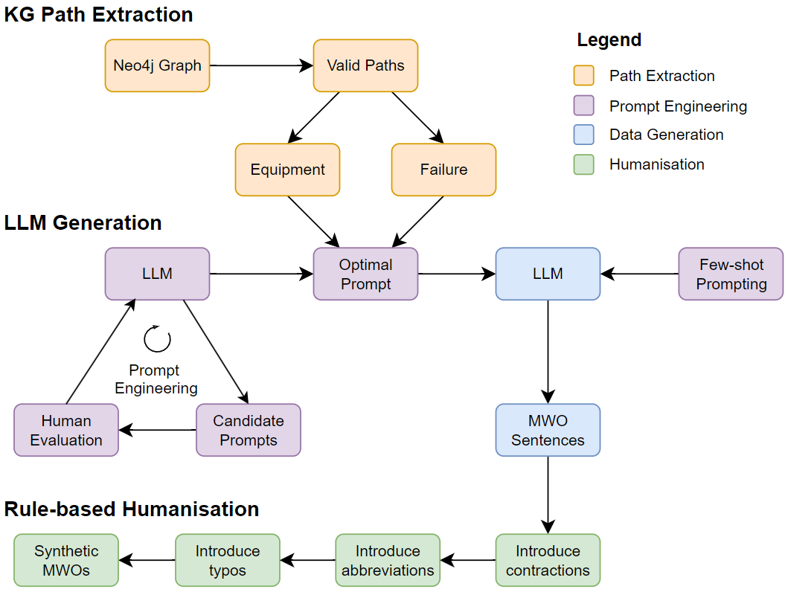

# Generating Authentic Grounded Synthetic Maintenance Work Orders (MWOs)

This repository contains the data, data analysis, code, and documentation for the Honours project titled "Generating Authentic Grounded Synthetic Maintenance Work Orders (MWOs)" by Allison Lau (2024). The project aims to generate synthetic MWOs that are grounded in real-world data and authentic to the domain of maintenance engineering. The project is supervised by Prof. Melinda Hodkiewicz, Dr. Caitlin Woods, and Dr. Michael Stewart

## Table of Contents

1. [Overview](#overview)
2. [Datasets](#datasets)
3. [Installation](#installation)
4. [Synthetic Data Generation Pipeline](#synthetic-data-generation-pipeline)
    1. [Equipment-Failure Path Extraction](#equipment-failure-path-extraction)
    2. [MWO Sentence Generation via LLM](#mwo-sentence-generation-via-llm)
    3. [MWO Sentence Humanisation via Rule-based Approach](#mwo-sentence-humanisation-via-rule-based-approach)
5. [Evaluation](#evaluation)
6. [Synthetic MWOs Files](#synthetic-mwos-files)

## Overview

Maintenance Work Orders (MWOs) are technical short texts documenting equipment conditions and failures, often containing confidential data, making real-world datasets scarce for machine learning. To address this, this research generates synthetic MWO sentences using a graph database to query equipment-failure relationships and Large Language Models (GPT-4o mini). The generated data mimics real MWOs by incorporating industry-specific jargon and grammar. 

## Datasets

This datasets used in this research are describe in the [`DATASETS`](https://github.com/nlp-tlp/Hons24_AllisonLau/blob/main/DATASETS.md) section of the repository. The datasets used/analysed in this project are:

- [FMC-MWO2KG dataset](https://paperswithcode.com/dataset/fmc-mwo2kg)
- [MaintIE dataset](https://github.com/nlp-tlp/maintie)
- [MaintNorm dataset](https://github.com/nlp-tlp/maintnorm)
- [Corrections dictionary](https://github.com/nlp-tlp/Hons24_AllisonLau/tree/main/data/Corrections)

## Installation

To install the required packages for the project, run the following steps:

1. Create a virtual environment using `python -m venv venv`
2. Activate the virtual environment using `venv/Scripts/activate` (Windows)
3. Install the required packages using `pip install -r requirements.txt`

## Synthetic Data Generation Pipeline

The synthetic data generation pipeline consists of three main steps:
1. Equipment-Failure Path Extraction
2. MWO Sentence Generation via LLM
3. MWO Sentence Humanisation via Rule-based Approach

The code for each step can be found in the respective directories in the repository.



### Equipment-Failure Path Extraction

The code for extracting equipment-failure paths from the MaintIE Knowledge Graph can be found in the [`PathExtraction`](https://github.com/nlp-tlp/Hons24_AllisonLau/tree/main/PathExtraction) directory. The following steps are performed:

### Types of Paths

We analysed the MaintIE gold standard dataset using a Neo4j graph database to develop paths that illustrate relationships between equipment (*PhysicalObject*) and failure modes (*UndesirableEvent*). These paths are classified as direct, showing immediate connections, or complex, involving intermediary entities. Additional paths are created by using hierarchical relations between equipment entities. This framework improves our understanding of component relationships within MWOs and informs the synthetic data generation process.


#### Load MaintIE Dataset into Neo4j Knowledge Graph

1. Make sure you have [Neo4j Desktop](https://neo4j.com/download) installed on your machine.
2. Open Neo4j Desktop, create a project and an instance of a graph database.
3. Create a `.env` file in the root directory and add the following environment variables:
```bash
NEO4J_URI="bolt://localhost:7687"
NEO4J_USER="neo4j"
NEO4J_PASSWORD="password"
```
4. Replace the `NEO4J_URI`, `NEO4J_USER`, and `NEO4J_PASSWORD` with your Neo4j instance details.
5. Start the database and open the browser.
6. Run `python maintie_to_kg.py` to load the MaintIE dataset into Neo4j.
Note: This will take a while to load the dataset into Neo4j.

#### Extracting paths (equipment and undesirable event combination) from Neo4j

1. Queries for extracting paths are stored in `path_queries.py`.
2. Run `python path_matching.ipynb` to extract paths from Neo4j.
3. Different paths are stored in their respective json files in `path_patterns` directory.
4. Analysis of paths can be found - total number of paths, frequency of equipment, frequency of undesirable events, frequency of inherent function of *PhysicalObjects*.

### MWO Sentence Generation via LLM

The code for generating synthetic MWO sentences using LLM can be found in the [`Generate`](https://github.com/nlp-tlp/Hons24_AllisonLau/tree/main/Generate) directory. 

#### Generate Synthetic MWO Sentences

1. Create a `.env` file in the root directory and add the following environment variables:
```bash
API_KEY="your_openai_api_key"
```
2. Run `python llm_generate.py` to generate synthetic MWO sentences using GPT-4o mini.
- Function used to generate synthetic MWO sentences: `generate_mwo()` and `generate_diverse_mwo()`
- Generated synthetic MWO sentences are stored in the [`mwo_sentences`](https://github.com/nlp-tlp/Hons24_AllisonLau/blob/main/Generate/mwo_sentences) directory. There is a log file (`log.txt`) detailing the given equipment + failure mode and the generated sentences. There is also a csv file (`order_synthetic.csv`) containing just the generated synthetic MWO sentences.
- You can alter the number of path samples by changing the `num_samples` parameter in `get_samples()` function. You can also choose to exclude certain path types by including their path names (json file) in the `exclude` list in `get_samples()` function.

Note: More documentation details for function implementations can be found in the [`DOCUMENTATION`](https://github.com/nlp-tlp/Hons24_AllisonLau/blob/main/DOCUMENTATION.md) section of the repository.

### MWO Sentence Humanisation via Rule-based Approach

The code for humanising synthetic MWO sentences can be found in the [`Humanise`](https://github.com/nlp-tlp/Hons24_AllisonLau/tree/main/Humanise) directory. 

#### Humanise Synthetic MWO Sentences

1. Run `python humanise.py` to test humanising synthetic MWO sentences using a rule-based approach.
- Function used to humanise synthetic MWO sentences: `humanise_sentence()`

Note: More documentation details for function implementations can be found in the [`DOCUMENTATION`](https://github.com/nlp-tlp/Hons24_AllisonLau/blob/main/DOCUMENTATION.md) section of the repository.

## Evaluation

The code for evaluating the synthetic MWO sentences can be found in the [`Evaluation`](https://github.com/nlp-tlp/Hons24_AllisonLau/tree/main/Evaluation) directory. More details on the evaluation can be found in the [`EVALUATION`](https://github.com/nlp-tlp/Hons24_AllisonLau/blob/main/EVALUATION.md) section of the repository. The following evaluations are performed:
- Paths and Synthetic MWO Analysis
- Turing Test
- Ranking Test (replicated from [Bikaun et al. 2022](https://github.com/nlp-tlp/cfg_technical_short_text))

## Synthetic MWOs Files

The synthetic MWOs generated over the course of the project can be found in different files:
- `Generate/mwo_sentences/order_synthetic.txt`: synthetic MWO sentences generated, including the inherent function of the equipment, the equipment, and the failure mode
- `Generate/mwo_sentences/synthetic.txt`: shuffled version of above
- `Generate/mwo_sentences/log.txt`: logs of MWO sentences generated, including the path (equipment + failure mode) and the number of sentences generated
- `Evaluation/Turing2/synthetic_generate_v2.txt`: synthetic MWO sentences generated for the Turing Test evaluation
- `Evaluation/Turing2/synthetic_humanise_v2.txt`: humanised synthetic MWO sentences for the Turing Test evaluation